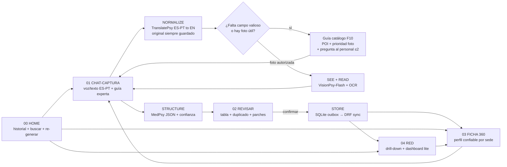
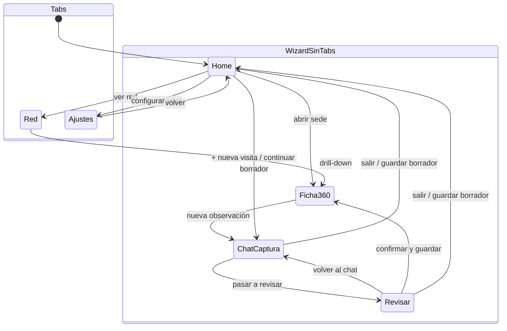
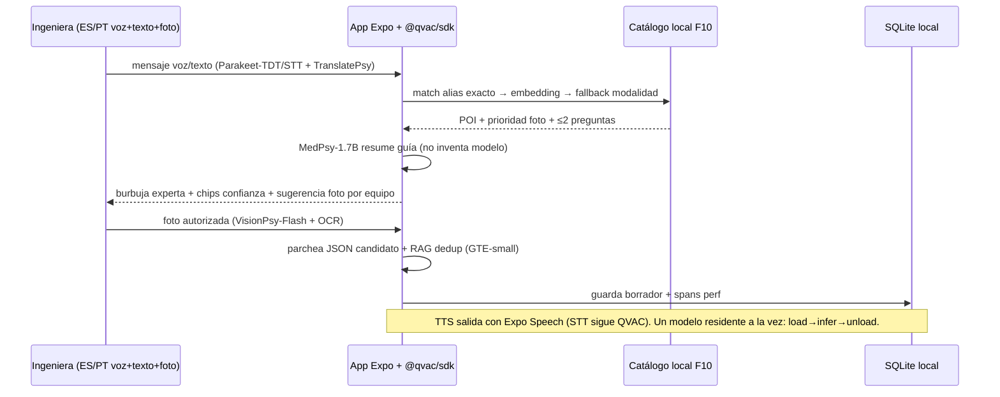
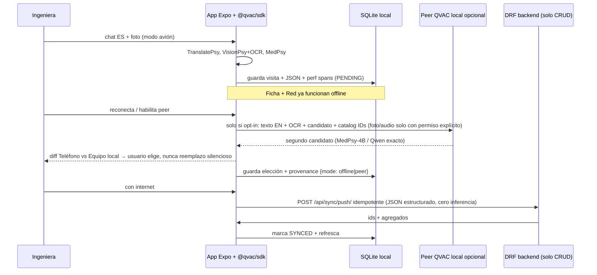

# APP_FLOW — screen + data flow (mermaid)

> Navegación: 4 destinos top-level en tabs. Wizard sin tabs. UI en español. Toda pantalla con IA: badge offline + model cards + disclaimer.
> Top-level tabs: `Inicio | (+) Nueva | Red | Ajustes`. Wizard: stepper superior, sin tabbar.

## 1. End-to-end visit flow (the video arc)



## 2. Screen navigation (tabs vs wizard)



Reglas:

* Tabs nunca representan pasos. Solo `Inicio / Nueva / Red / Ajustes`.
* Wizard (`01`, `02`) NO tiene tabbar. Tiene `< Salir`, stepper superior `Paso 1 de 2 / 2 de 2`, CTA inferior `Pasar a revisar / Confirmar y guardar`, y `Guardar borrador`.
* `03 Ficha` NO es `Paso 3`. Es destino persistente desde `Inicio` o `Red`.
* `05 Ajustes` es top-level, no parte del wizard.

## 3. Chat-captura loop (the expert feeling)



## 4. Confidence lifecycle (the trust story)

```mermaid
flowchart TD
    U[Unknown<br/>campo ausente] --> R[Reported<br/>dicho una vez]
    R --> E[Estimated<br/>inferido foto-edad]
    R --> C[Confirmed<br/>revisita o foto+OCR coinciden]
    E --> C
    C --> S polite: STALE?
    S -- >180 días --> RV[re-verificar]
    RV --> C
```

## 5. Offline-first data path + optional peer (P1)



Peer NO es Django. Django nunca carga modelos. `qvac serve --openai` solo dev.

Previews: `SCREEN_00_HOME.html`, `SCREEN_01_CAPTURE.html` (chat), `SCREEN_02_REVIEW_VALIDATE.html`, `SCREEN_03_CUSTOMER_360.html` (ficha), `SCREEN_04_MAP_DASHBOARD.html`, `SCREEN_05_SETTINGS.html` — abrir en ventana angosta de teléfono; hallway-test antes de codificar.
