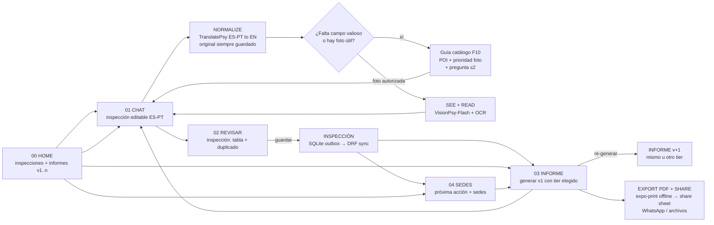
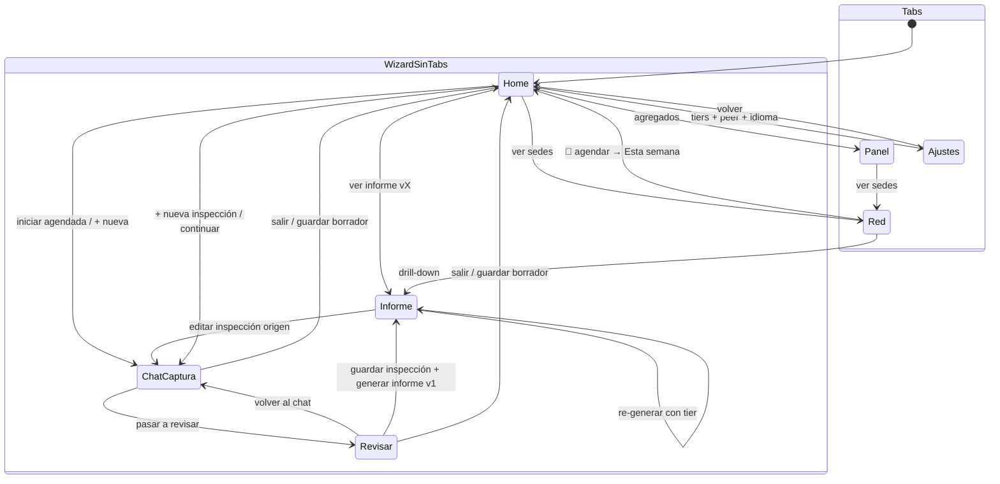
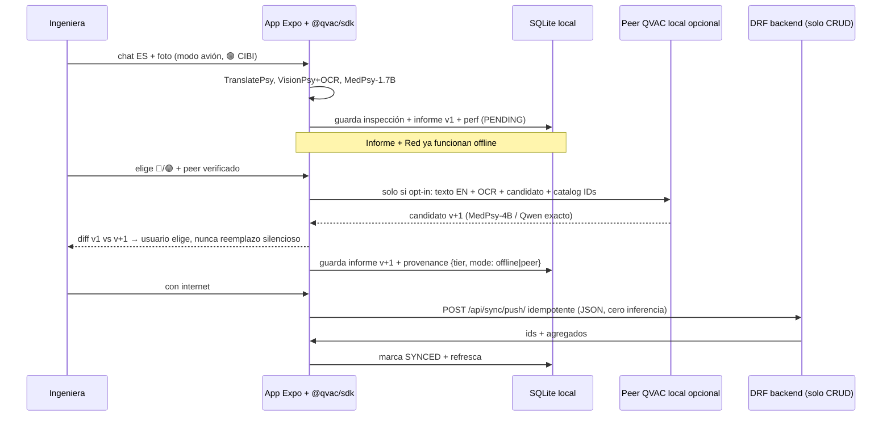

# APP_FLOW — screen + data flow (mermaid)

> Navegación: 4 destinos top-level en tabs (`Inicio | Panel | Red | Ajustes`, 4 tabs iguales, sin FAB desbordado). `+ Nueva` es CTA en Inicio, no tab. Wizard sin tabs. UI ES por defecto + switch EN en Ajustes. Toda pantalla con IA: badge offline + model cards + disclaimer.
> Vocabulario locked: **inspección** = captura editable (siempre accesible/editable) · **informe** = reporte generado desde una inspección (generable/re-generable cuando quieras, con el tier que quieras).
> Tiers (1 clic, preselección 🟢, mascotas en `assets/mascot-cibi|pro|super.png` + nombre honesto siempre visible):
> **🟢 CIBI regular (on-device, siempre)**: TranslatePsy-EuroNano + VisionPsy-Nano-460M-Flash Q8_0 + OCR_LATIN + MedPsy-1.7B-Q4_K_M + GTE-small. Rápido, offline, el del video juzgado.
> **🔵 CIBI Pro (peer QVAC)**: MedPsy-4B-Q8 (estructura dominio) + Qwen3.5-4B* (guía/fluidez). *Candidato verificado en HF pero falta pinnear ID exacto registry QVAC + quant + ctx + licencia + `qvac doctor` en peer.
> **🟣 CIBI Super (peer QVAC)**: Qwen oficial grande* (razonamiento) + MedPsy-4B anclando entidades (Qwen nunca solo en entidades médicas). *Solo releases oficiales (ej. familia Qwen3.8-Flash oficial). Forks “Uncensored/Aggressive/HauhauCS” EXCLUIDOS: licencia de reempaque dudosa + copy “sin refusals” incompatible con framing equipo-médico + riesgo jurado + 27B (15–31GB) inviable 48h. Si se quiere 27B, que sea oficial Apache-2.0 + HW peer declarado.
> Mismo modelo puede hacer visión+texto solo si es variante multimodal oficial con projector; si no, VisionPsy-Flash sigue haciendo modalidad y Qwen razona sobre texto/OCR/candidato. Psy siempre en el loop (Track 2).

## 1. End-to-end inspection → report flow (the video arc)



Reglas:

* Tabs nunca representan pasos. Solo `Inicio / Panel / Red / Ajustes` (4 iguales, icono 19px + label 10px, sin overflow). `Panel` = agregados offline (cero inferencia); `Red` = sedes + próxima acción.
* Wizard (`01`, `02`) NO tiene tabbar. Tiene `< Salir`, stepper `Paso 1 de 2 / 2 de 2`, CTA inferior, y `Guardar borrador`.
* `03 Informe` NO es paso. Es reporte versionado de una inspección, re-generable con 🟢/🔵/🟣. La inspección origen nunca se bloquea.
* Composer chat estilo WhatsApp: un input redondeado con 📷 + 🎙️ dentro + botón enviar ➤.

## 2. Screen navigation (tabs vs wizard)



## 3. Chat-captura loop + tiers

```mermaid
sequenceDiagram
    participant U as Ingeniera (ES/PT voz+texto+foto)
    participant A as App Expo + @qvac/sdk
    participant C as Catálogo local F10
    participant L as SQLite local
    U->>A: elige tier (🟢 siempre; 🔵/🟣 solo si peer verificado)
    U->>A: mensaje (input WhatsApp: texto/🎙️/📷 + TranslatePsy)
    A->>C: match alias → embedding → fallback modalidad
    C-->>A: POI + prioridad foto + ≤2 preguntas
    A->>A: tier activo resume guía (no inventa modelo)
    A-->>U: burbuja experta + chips + sugerencia foto por equipo
    U->>A: foto autorizada (VisionPsy-Flash + OCR)
    A->>A: parchea inspección + RAG dedup (GTE-small)
    A->>L: guarda inspección borrador + spans perf {tier, model}
    Note over A,L: Un modelo residente a la vez: load→infer→unload.
```

Tier honesty: UI muestra mascota + `🟢 CIBI = VisionPsy-Flash-Q8 + MedPsy-1.7B-Q4` etc. Pro/Super bloqueados (🔒) sin peer verificado con ese modelo cargado. Qwen NO sustituye historia Track 2 (los Psy son el pipeline juzgado); Super es P1.

## 6. Export PDF + compartir (offline, sin inferencia)

`Informe vX (JSON local) → plantilla HTML local (expo-print) → PDF en teléfono → share sheet (expo-sharing) → WhatsApp/archivos/drive`. Funciona en modo avión. Contenido fijo: portada sede+fecha, banner “Extracción de inventario de equipamiento. No es diagnóstico clínico.”, tabla parque + confianza/frescura, procedencia {tier, modelos exactos+quants, device/peer_id}, resumen perf (load/TTFT/tokens/throughput por modelo), `synthetic:true`, historial v1..n. Aceptación: exportar sin red, abrir PDF, aparece WhatsApp en el sheet. Backend intacto (CRUD/sync).

## 4. Confidence lifecycle (the trust story)

```mermaid
flowchart TD
    U[Unknown<br/>campo ausente] --> R[Reported<br/>dicho una vez]
    R --> E[Estimated<br/>inferido foto-edad]
    R --> C[Confirmed<br/>revisita o foto+OCR coinciden]
    E --> C
    C --> S polite: STALE?
    S -- >180 días --> RV[re-verificar]
    RV --> C
```

## 5. Offline-first + informe versionado + peer opcional (P1)



Peer NO es Django. Django nunca carga modelos. `qvac serve --openai` solo dev. Idioma UI (ES/EN) no cambia pipeline: captura siempre ES/PT→EN.

Previews: `SCREEN_00_HOME.html` (inspecciones), `SCREEN_01_CAPTURE.html` (chat WhatsApp + tiers), `SCREEN_02_REVIEW_VALIDATE.html`, `SCREEN_03_REPORT.html` (informe versionado + PDF), `SCREEN_04_MAP_DASHBOARD.html` (Red: sedes + próxima acción), `SCREEN_05_SETTINGS.html` (tiers + idioma + peers), `SCREEN_06_PANEL.html` (Panel: agregados offline, cero inferencia).
